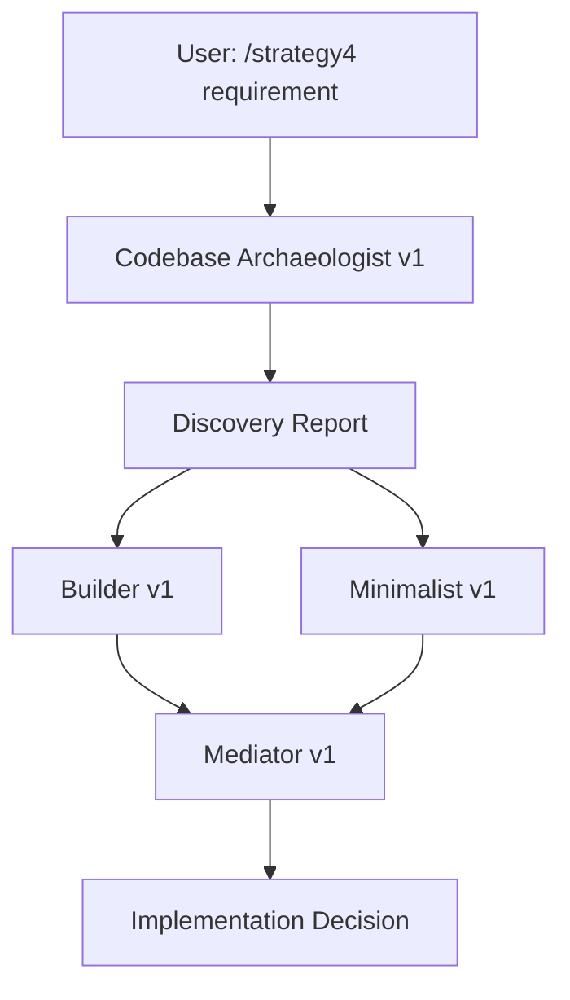

# Agent Version Log

This file tracks all custom agents and their versions for the automated workflow system.

## Active Agents

| Agent Name | Version | Created | Purpose | File |
|------------|---------|---------|---------|------|
| Codebase Archaeologist | v1.0.0 | 2025-10-28 | Discovers existing code, patterns, and utilities before implementation | `codebase-archaeologist-v1.md` |
| Builder | v1.0.0 | 2025-10-28 | Proposes architecturally sound solutions with patterns and abstractions | `builder-agent-v1.md` |
| Minimalist | v1.0.0 | 2025-10-28 | Challenges abstractions and proposes simplest solutions (YAGNI) | `minimalist-agent-v1.md` |
| Mediator | v1.0.0 | 2025-10-28 | Evaluates competing proposals and makes final implementation decision | `mediator-agent-v1.md` |
| Obsidian Formatter | - | 2025-09-25 | Formats documents for Obsidian vault | `obsidian-formatter.md` |
| Obsidian Link Enhancer | - | 2025-09-25 | Adds intelligent wikilinks to documents | `obsidian-link-enhancer.md` |

## Agent Workflow: Strategy 4



## Version History

### v1.0.0 (2025-10-28)
- **Codebase Archaeologist v1**: Initial release
  - 7-phase discovery process
  - Indexes utilities, patterns, similar features
  - Generates comprehensive Discovery Report
  - Prevents reinventing the wheel

- **Builder v1**: Initial release
  - Proposes SOLID principles and design patterns
  - Argues for proper architecture
  - Defends complexity with justification

- **Minimalist v1**: Initial release
  - Champions YAGNI and boring code
  - Challenges every abstraction
  - Proposes simplest viable solution

- **Mediator v1**: Initial release
  - Evaluates requirements vs complexity
  - Analyzes codebase pattern conformity
  - Calculates simplicity scores
  - Makes final implementation decision

## Upgrade Process

When creating a new version:

1. **Copy existing agent**: `cp agent-name-v1.md agent-name-v2.md`
2. **Update version in frontmatter**: `version: 2.0.0`
3. **Update title**: `# Agent Name v2`
4. **Document changes**: Add to Version History section below
5. **Update commands**: Update any slash commands that reference the agent
6. **Test**: Run `/strategy4` or relevant command to verify
7. **Log**: Update this AGENT_LOG.md with changes

## Agent Invocation Examples

### Codebase Archaeologist v1
```
/strategy4 Add payment history endpoint
```
→ Automatically invokes archaeologist first

### Manual invocation (from another command)
```
Subagent: codebase-archaeologist-v1
Prompt: "Discover existing code for [requirement]..."
```

### Builder + Minimalist (parallel)
```
// In strategy4.md - automatically orchestrated
Subagent: builder-agent-v1
Subagent: minimalist-agent-v1
```

### Mediator
```
// In strategy4.md - automatically invoked after Builder + Minimalist
Subagent: mediator-agent-v1
```

## Future Agents (Planned)

- [ ] **Test Strategist**: Proposes comprehensive test coverage strategy
- [ ] **Security Auditor**: Reviews proposals for security concerns
- [ ] **Performance Analyst**: Analyzes performance implications
- [ ] **Documentation Writer**: Generates documentation from proposals
- [ ] **Migration Planner**: Plans refactoring from current to proposed state

## Metrics to Track

For each agent execution, consider logging:
- Agent name + version
- Timestamp
- Input (requirement/prompt)
- Output summary
- Execution time
- Which agent "won" (for Strategy 4)
- Human feedback on result quality

Consider implementing structured logging in `.claude/agent-execution-log.json`.
